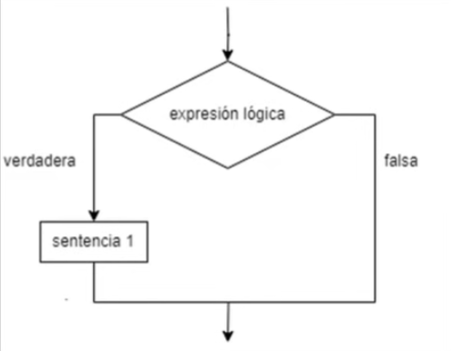

# Java for Testers

- Sección 5 - Java Basics
  - Java Operators
    - Arithmetic Operators
    - Assignment Operators
    - Comparison Operators
      - Respuesta Booleana: 'true/false'.

        - ```java
            System.out.println(a == b)
            ```

      - Esto es importante para entender lógica en las estructuras Condicionales.
    - Logical Operators
      - AND

        - ```java
            System.out.println(3 > 2 && 10 < 15)
            ```

      - OR

        - ```java
            System.out.println(3 > 2 || 10 < 9)
            ```

  - Estructuras Condicionales
    - If
      - 
    - If / Else
    - If / Else If
    - Switch
      - Break
      - NOTE on 'Advanced Selenium' from Dmitry Shishkin in Udemy.
    - Operador Ternario

  - Estructuras Repetitivas
    - Por Contador
      - For
    - Por Centinela
      - While
      - Do While
    - Try - Catch
    - Break & Continue
