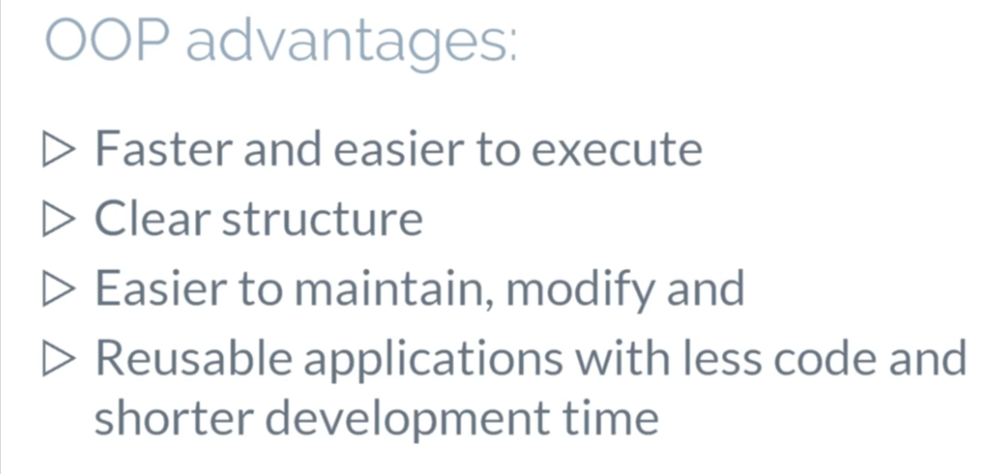
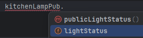

# Section 7 - Object-Oriented Programming (OOP)

---

## 7.1 - Java OOP generals (34)

Object-oriented programming is the programing paradigm based on the concept of 'objects' that contain 'data'
and 'methods'.

The primary purpose of object-oriented programming is to increase the flexibility and maintainability
of programs.

Object-oriented programming has several advantages over procedural programming:

- OOP is faster and easier to execute.
- It provides a clear structure for the programs, makes the code easier to maintain, modify and debug.
- And OOP makes it possible to create full, reusable applications with less code and shorter development time.




- `Classes` and `Objects` are the two main aspects of Object-Oriented Programming.
- A class is a template for the object, and an object is an instance of a class.
- When the individual objects are created, they inherit all the variables and methods from the class.
- A class is the blueprint for the object before we create an object.
- We first need to define the class.

We can think of the 'class' as the sketch of the house. It contains all the details about the floors, doors, windows, etc.

Based on these descriptions, we build the house. House is an 'object'.

Since many houses can be made from the same description. We can create many objects from the same class.

---

### 7.2 - Classes and Objects (35)

Let's start creating an empty `Main0` class.

````java
public class Main0 {
    public static void main(String[] args) {

    }
}
````

Next, let's create another class `ClassDemo0`

Create an integer `variable`

and

let create a `method` that prints this variable.

````java
public class ClassDemo0 {
  private int number = 5;   // PRIVATE

  public void printNumber(){   // PUBLIC
    System.out.println("The number is " + number);
  }
}
````

Note that our **variable** is `private`, but the **method** is `public`.

This means that we can access this method from outside this class, but we cannot access our variable from outside.

---

First, let's learn how to create an _**INSTANCE**_ of our `ClassDemo0`.

>
>>The same way when we create new integer or new string, we start typing the _**TYPE**_ of the object, and in our case 
the 'type' is the _**class name**_  `ClassDemo`.

And let's call this _**OBJECT**_ 'instancia'.
````java
public class Main0 {

      public static void main(String[] args) {
          ClassDemo instancia = new ClassDemo();      
      }
}
````

We use the class as a blueprint and create a new **instance** of a class and call it `instancia`.

Now, using this **instance** of a class, we can execute the public method `printNumber()` of the class.

Let's start type 'instancia' and as you see, we can access this print number 'method' from `Main0` Class.


So let's use this `instance` of the  **_printNumber_** method in `ClassDemo0`, by only running the `Main0` Class.


````java
public class Main0 {
    public static void main(String[] args) {

        ClassDemo instancia = new ClassDemo();
        instancia.printNumber();
        
    }
}
````

**OBSERVE:** that only `Main0` class have the RUN button next to it, meaning we cannot run `ClassDemo0` unless its
_**instantiated**_ .


Let's create another instance of the same method, in `Main0` 

````java
public class Main0 {
    public static void main(String[] args) {

        ClassDemo instancia = new ClassDemo();
        ClassDemo instancia2 = new ClassDemo();

        instancia.printNumber();
        instancia2.printNumber();

    }
}
````

As expected, the number is five was printed `two` times here

Here, `instancia` and `instancia2` are the names of `objects`.

We can use them to access fields and methods of the class.

As you can see, we have created two objects of the same class.

We can create multiple `objects` of a single `class` in Java.

---

### 7.3 - Classes and Objects Examples (36)

Let repeat the exercise, buy this time with a _**PRIVATE**_ boolean variable.


`LampPrivate.java`

````java
public class LampPrivate {
    private boolean lightStatus = false; //Private variable, meaning it's NOT accesible from outside this class.

  // This ´public ' method is accesible from other classes
    public void privateLightStatus(){  
        if (lightStatus){
            System.out.println("The lamp is ON");
        } else {
            System.out.println("The lamp is OFF");
        }
    }
}
````

Let create an Object from this class, and instantiate it in `Main1` Class.

````java
public class Main1 {
        public static void main(String[] args) {
// PRIVATE variable

            // Create two objects from LampPrivate Class
    LampPrivate kitchenLampPriv = new LampPrivate();
    LampPrivate bedrooomLampPriv = new LampPrivate();

            // Instantiate 'privateLightStatus' method from those two objects.
    kitchenLampPriv.privateLightStatus();
    bedrooomLampPriv.privateLightStatus();

    }
}
````

Output

>The lamp is OFF
>
>The lamp is OFF

>> Since the variable is PRIVATE, every instance is going to deliver the same result.

Let's create the same method, with a PUBLIC variable.

````java
public class LampPublic {

    public boolean lightStatus = false; //NOW accesible from outside this class, 'Main' class

    public void publicLightStatus(){
        if (lightStatus){
            System.out.println("The lamp in the "  + " is ON");
        } else {
            System.out.println("The lamp in the " + " is OFF");
        }
    }
}

````

By making '`lightStatus`' variable '`public`' in '`LampPublic`' class, we can access it from another classes.



Variable is 'true' because we used instance of a class when we changed the light status variable. 
We changed it only in one instance, `kitchenLampPub`.

`kitchenLamp` and `bedroomLamp` are two separate INDEPENDENT `objects`.

````java
public class Main1 {
    public static void main(String[] args) {
// PRIVATE variable
        System.out.println("------------------------------------------");
        System.out.println("Outcome of LampPrivate");
    // Create two objects from LampPrivate Class
        LampPrivate kitchenLampPrivy = new LampPrivate();
        LampPrivate bedrooomLampPriv = new LampPrivate();

    // Instantiate 'privateLightStatus' method from those two objects.
        kitchenLampPrivy.privateLightStatus();
        bedrooomLampPriv.privateLightStatus();

// PUBLIC variable
        System.out.println("------------------------------------------");
        System.out.println("Outcome of LampPublic");
        // Create two objects from LampPrivate Class
        LampPublic kitchenLampPub = new LampPublic();
        LampPublic bedroomLampPub = new LampPublic();

        // Instantiate 'publicLightStatus' method from those two objects.
        kitchenLampPub.publicLightStatus();
        bedroomLampPub.publicLightStatus();

        System.out.println("------------------------------------------");
        System.out.println("Change a 'local' PUBLIC variable in one object and re-print");
        kitchenLampPub.lightStatus = true;

        // Instantiate 'publicLightStatus' method from those two objects.
        kitchenLampPub.publicLightStatus();
        bedroomLampPub.publicLightStatus();

    }
}

````

The values of variables can be different. These are known as `local variables` inside each object, despite being 
created from the same Class, they are two independent entities.

They have the same methods and the same variables because they were created from the same class.

But now we can change the values of instances, and these objects are similar, but not the same.

---

### Class 37 - Java 'Constructors'

Source in Spanish: [Constructors](https://blog.hubspot.es/website/que-es-constructor-java)

`LampPrivate.java`

There are actually three types of constructors in Java.

- **No ARG** Constructor
- **Parameterized** constructor and
- **Default** constructor

Constructors are usually placed at the beginning of the Java class, after variables and before all other methods.


A 'constructor' has the same name as the class

---

And unlike **method**, doesn't have a `return` type, so we don't have to put 'void' or anything like this here in the constructor.

---

- **No ARG** Constructor

````java
    public class LampPrivate {
    //    private boolean lightStatus = false; //NOT accesible from outside this class, 'Main1' class
    public boolean lightStatus = false; //NOW accesible from outside this class, 'Main1' class
    
      //No ARGS constructor
        public LampPrivate(){
              System.out.println("Creating an object of a LampPrivate class");
            }

    }
````

---

- **Parameterized** constructor

Class
````java
    public class LampPrivate {

    public boolean lightStatus = false; 
    private String roomName;
    
    
      // Parameterized constructor
        public LampPrivate(String room){      // <<<< Now the constructor ASK for a parameter
            roomName = room;
            System.out.println("Creating " + room + " instance");
        }

        public void printLightStatus(){
            if (lightStatus){
                System.out.println("The lamp in the " + roomName + " is ON");
            } else {
                System.out.println("The lamp in the " + roomName + " is OFF");
            }
        }
    }
````

Main1 - calling the constructors

````java
    public class Main1 {
    
        public static void main(String[] args) {
    
    /*        ClassDemo instancia = new ClassDemo();
    instancia.printNumber();
    
            ClassDemo instancia2 = new ClassDemo();
            instancia2.printNumber();*/
    
            LampPrivate kitchenLamp = new LampPrivate("Kitchen"); // Summon the constructor, with a parameter
            LampPrivate bedroomLamp = new LampPrivate("Bedroom");
    
    
            kitchenLamp.printLightStatus(); // Executing the constructor
            bedroomLamp.printLightStatus();
    
    // By making 'lightStatus' variable 'public' in 'LampPrivate' class, we can access it from another classes
    
            kitchenLamp.lightStatus = true;
    
            kitchenLamp.printLightStatus();
            bedroomLamp.printLightStatus();
        }
    
    }
````

Output

>Creating Kitchen instance       << Now we can differenciate an instance from another

>Creating Bedroom instance       << Now we can differenciate an instance from another

>The lamp in the Kitchen is OFF
> 
>The lamp in the Bedroom is OFF
> 
>The lamp in the Kitchen is ON
> 
>The lamp in the Bedroom is OFF

### Access Modifiers

- Default
- Private
- Protected
- Public

Access modifiers are used to set the accessibility or visibility of classes, interfaces, variables, methods and constructors.

- Default

    - If access modifier is default, the code is only accessible in the same package.

    - This is used when we don't specify a modifier, so we don't write default. We just don't write anything.

- Private

    - If Access Modifier is private, the code is only accessible within the declared class.

- Protected
    - For the protected, the code is accessible in the same package and subclasses.
    - We will learn about this later when we'll learn inheritance.

- Public
    - The Code is accessible for all classes.

Access modifiers are mainly used for `encapsulation`.

It can help us to control what part of a program can access the members of the class so that misuse of data can be prevented.

As the rule of thumb, I suggest making everything `private` when you create that and then change the access modifier if you need to use this part of the code elsewhere.

### Homework6
        /*
        Create a class called 'Programming'
        This class should have a constructor, that accepts argument (Parameterized constructor)
        This class should have a method called learningStatus()
        Also, class should have another boolean variable, learningComplete. The default value should be FALSE.

        Second method of the class, that is called completeLearning()
        This method should just change the value of learningComplete() variable from FALSE to TRUE.
        learningStatus() method should print "Learning ..." and the name of the language. if you are still learning.
        And, if you finish learning, then the message should be "Mastered..." and the language name

        Here in Main1 method, create an object of a class.
        Call learningStatus() method to print the status
        Then change the status using completeLearning() method
        And call learningStatus() method to print the status again

         */
---
`Programming.java`

    public class Programming {
    
    //Class attributes
    private String language; // Class level variable, to use it in other constructors.
    private boolean learningComplete = false;
    
    // Constructor
    public Programming(String language){  //Class level variable AND constructor parameter are both Strings and have the same name.
    this.language = language;         // 'this'. refers to the class level variable, NOT the constructor parameter.
    // 'this.' is used to eliminate confusion between class attributes and parameters with the same name.
    }
    
    
    // Methods
    public void learningStatus(){
    if (learningComplete){
    System.out.println("Mastered " + language); // Class level variable, not confussion.
    } else {
    System.out.println("Learning " + language); // Class level variable, not confussion.
    }
    
            }
    
        public void learningComplete(){
            learningComplete = true;
        }
    
    }

`Main1.java`

        Programming programming = new Programming("Java");  // Use this `Programming` class to create an instance named `programming` in `Main1` class.
        programming.learningStatus();
        programming.learningComplete();
        programming.learningStatus();
---

### 'Static' Keyword

`ClassDemo.java` `Main1.java`

The static can be:
- Variable
- Method
- Block
- Nested Class

Anything labeled as `STATIC`, belongs to the `Class` instead of the '**instance**', '**Object**' or '**Method**'.

It's not a volatile memory, it sticks to a value.

The static keyword in Java is used for memory management.
- The static variable is used to refer to common property of all objects, and it gets memory only once in the class area; at the time of class loading.

The static keyword belongs to the `class` rather than an `instance` of the class.
- So if we use instance to change it, it will be changed for all instances of the class.

---

As you see, `text` is static, `number`, is not.


    public class ClassDemo {
        public int number = 5; // Not 'static', can be different value inside INSTANCES.
        public static String text = "Some text";   // STATIC variable belongs to CLASS, same for ALL instances.

            public void printNumber(){   // PUBLIC
                System.out.println("The number is " + number);
            }

            public void printText(){   // PUBLIC
                System.out.println("The text is " + text);
            }

    }

---

    public class Main1 {

      public static void main(String[] args) {
    
          ClassDemo instancia = new ClassDemo();
          ClassDemo instancia2 = new ClassDemo();
    
          instancia.number = 10;
          instancia2.text = "New Text";  //IntelliJ suggest an improvement, we'll implement later.
    
          instancia.printNumber();
          instancia2.printNumber();
    
          instancia.printText();
          instancia2.printText();
    
     >    ClassDemo.text = "Third Text"; // Access 'ClassDemo.text' via class 'ClassDemo' reference DIRECTLY.
          instancia.printText();
  
      }
    
    }

So when we created the class, we can change the `number` for each instance.

But this `text` variable is part of the class, is **not** part of the instance.

We can use instance to change it, but it will change this variable (the static `text` variable) for all instances.

That's why when we printed text, for instance, one, it was not 'some text', it's 'new text'.

---

We don't even need to have instance to access it. `ClassDemo.text`

We cannot access no or other methods because they are not static, but `text` is static.

---

---
Similarly to static variables, we can create `static` methods.

A static method belongs to the class rather than the object of the class, and it can be invoked without
the need for creating an instance the same way we access and invoked this variable.

Also `static method` can access `static data member` and can change the value of it.

#### BEFORE

ClassDemo.java

    public void printText(){   // PUBLIC
        System.out.println("The text is " + text);
    }

Main1.java

    instancia.printText();

#### AFTER

ClassDemo.java

    public static void printText(){   // PUBLIC
        System.out.println("The text is " + text);
    }

Main1.java

    ClassDemo.printText();

We can use instances to access static methods like we did here to access static variables or because this method is static we can call it directly from the class.

### Four pillars of OOP
Main1 four principles of Object-Oriented-Programming

#### Basic elements

##### Object

    Object is the instance of the class, is the working entity of the class

##### Class

    This is the model or standard about the capability of what an object can do.

##### Method

    Method can modify a class state that would apply across all the instances of the class.

##### Instance

    Instances are like objects. However, let think about them in these terms. 
    
    A blueprint for the car design is the class description.

    All the cars manufactured from that blueprint are object of that class, `instances`.

    Your car that has been made from the blueprint is basically an instance of the class.

---

#### The four principles of Object-Oriented-Programming are:
##### Encapsulation

Access modifiers are mainly used for `encapsulation`.     (881)

      Encapsulation is one of the key features of object-oriented programming.
      
      Encapsulation refers to the bundling of fields and the methods inside the single class.
      
      It prevents outer classes from accessing and changing fields and methods of the class. This also helps to achieve data hiding.
      
      In Java encapsulation help us to keep related fields and methods together, which makes our code cleaner and easy to read.
      
      It helps to decouple components of this system. This decoupled components can be developed, tested and debugged independently. 
      Any changes in the particular component do not have any effect on other components.

##### Abstraction

      Abstraction is an extension of encapsulation.
      
      It is an important concept of object-oriented programming that allows us to hide unnecessary details and only showed the needed information.
      
      This allows us to manage complexity by a meeting or hide in details with simpler, higher level idea.
      
      A practical example of abstraction can be car breaks.
      
      We know what brakes do when we applied the brakes. The car will stop, however, the working of the brakes is kept hidden from us.
      
      The major advantage of hiding the working of the brakes is that now the manufacturer can implement brakes differently for different cars. However, what brakes do will be the same.

##### Inheritance

      Inheritance is one of the key features of OOP that allows us to create a new class from existing class.
      
      The new class that is created the is known as `subclass` or `child class`, and the existing class from where the child class is derived is known as `super class` or `parent` or `base` class in Java.
      
      Inheritance is a relationship. We use inheritance only if there exists and is a relationship between two classes.
      
      For example:
      - Car is a vehicle.
      - Orange is a fruit.
      - Dog is a animal 
      
      Here, Car can inherit from vehicle, Orange can inherit from fruit and so on.
      
      In test automation, we use it for `Page Object Model`.
      
      `Login` Page is a page; `checkout` page is a page, so we can have a parent page class and different subclasses that inherit from parent class.
      
      The most important use of inheritance in Java is called re-usability.
      
      The code that is present in the parent class can be directly used in the child class

##### Polymorphism

      Polymorphism simply means more than one form. The same entity, method, operator or object can perform different operations in different scenarios.
      
      The most common use of polymorphism in OOP occurs when a parent class reference is used to refer to a child class object.
      
      Any Java object that can pass more than one is a test is considered to be polymorphic.


#### Encapsulation

`Cat.java`
`Main2.java`

The meaning of encapsulation is to make sure that sensitive data is hidden from users.

To achieve this, you must declare class variables attributes as `private`.


Use this `Cat` class to create an instance of `cat` in `Main2` class.

Provide public `Get` and `Set` methods to access and update the values of the private variables.

---

As you see, encapsulation gives us a better control of class attributes and methods.

Class attributes can be made a `read only` if you only use the `get method` like `breed` or `write only` if
you only use this `set methods`.

This increases security of data.

#### Abstraction
Data Abstraction is the process of hiding certain details and showing only essential information to the user.

Abstraction can be achieved with either Abstract Classes or interfaces. Let's use abstract Class in this example.

`Animal.java`

    abstract class Animal {
    
      abstract void makeSound(); //Abstract methods don't have a body.
  
      public void sleep(){
          System.out.println("Sleeping ...... zzzzz");
      }
    
    }

The abstract keyword is a NON access modifier used for classes and methods.

Abstract class is the restricted class that cannot be used to create objects to access. It must be inherited from another class.

Abstract method can only be used in the abstract class, and it doesn't have a body. The body is provided by the subclass inherited from.

---

We cannot create `objects` from the abstract class.

    Animal animal = new Animal();

`Animal` is Abstract, cannot be instantiated in order to use it.

We must `inherit` from this class and implement abstract methods in this subclass.

#### Inheritance

It is possible to inherit `attributes and methods` from one class to another when it comes to `inheritance`.

We need to know the words:
- `Subclass` (Child), the class that inherits a from another class and
- `Super class` (parent), The class being inherited from.

---

We have an `animal` class and a `cat` class. `cat` is a `animal` so we can use inheritance here.

To inherit from a class we use the `extends` keyword.

    public class Cat extends Animal{

IntelliJ showed us an error. That's because our `animal` class has abstract method `makeSound()`, which we must implement in `Cat` class.

So hover over the error and select this implement methods link.

So just click on it, `makeSound()`.

This added an empty `makeSound()` method to our class `Cat` with this annotation `Override`.

    @Override
    void makeSound() {

    }

We add a simple action:

    @Override
    void makeSound() {
        System.out.println("Miau!");
    }

Switch back to `Main2` method.

Since our `Cat` class (already instanced in `Main2`) extends `Animal` class, we can use `cat` instance here.

    cat.makeSound();
    cat.sleep();

- We can use `makeSound()` that is `abstract` and implemented inside `Cat` class.
- And we can use `Super Class` method `sleep()` because `Cat` class inherits this method from the `Parent` class `Animal`.
- We can use all public methods inside the `Animal` class.

#### Polymorphism

`Polymorphism` means many forms, and it occurs when we have many
classes that are related to each other by `inheritance`.

Like we learned in the previous lecture, inheritance
lets us inherit attributes and methods from another class.

Polymorphism uses those methods to perform different tasks.

This allows us to perform a single action in different ways.

For example, our super superclass `Animal` has a method `makeSound()`,
and we implemented this method inside the `Cat` class to print `Miau`.
---
We created new class `Dog`, which extends `Animal`; to be able to extend the Animal
(an `abstract class`) we have to implement `abstract method` called `makeSound()` method in `Dog` class.

Now, we need to create an `INSTANCE` of the `Dog` class in `Main2` method
in order to invoke the `makeSound()` abstract method from `Animal` class.

The source routing follows:

`Abstract method > Abstract Class > Class inheritance and Method implementation > Instancing Objects in Main1 Class`

`makeSound() > Animal > Dog & CAT > Main2`

`Dog.java`

    public class Dog  extends Animal{
    
        @Override
        void makeSound() {
            System.out.println("Guau!");
        }
    }

`Main2`

        Dog dog = new Dog();
        dog.makeSound();
        dog.sleep();

### Overriding

Let's talk about overriding today.

In the previous lectures, we talked about super classes and some
classes.

If a class inherits a method from its super class, then there is a chance to overwrite the method.

In object-oriented terms, overriding means to override the functionality of an existing method.

---
In `Main2` class, we're instancing `Cat` and `Dog` class with `makeSound()` abstract method from `Animal` class

The moment we inherit abstract class `Animal`, IntelliJ shows an error with a MUST include this, and automatically
applies the tag `@Override`.

    @Override
    void makeSound() {
        System.out.println("Miau!");
    }


`BEFORE`

    Miau!
    Sleeping ...... zzzzz
    Guau!
    Sleeping ...... zzzzz
---
But it's no exclusive for abstract methods.

We also can `@Override` regular methods inside an abstract class and make it individual for a particular Instance.

In `Dog` class we did this:

`bad - Dog`

    public void sleep(){
        System.out.println("Dog is sleeping.... zzzzz");
    }

But IntelliJ is perfectible; it only shows a message alert, it doesn't apply the tag.

We need to add it manually.

`good - Dog`

    @Override  // <<<< Good Practice
    public void sleep(){
        System.out.println("Dog is sleeping.... zzzzz");
    }


`AFTER`

    Miau!
    Sleeping ...... zzzzz
    Guau!
    Dog is sleeping.... zzzzz

### 'Super' Keywords

The `super` keyword in Java is used in `subclasses` to
access `super class` members:
- Attributes,
- Constructors and
- Methods.

---
The `Super` keyword refers to a `super`, `parent` or `base` class in Java.
See `Inheritance` for a refresh of concepts.
---
Uses of `super` keyword:
- to call methods from of the superclass that is Override in subclass.
- to access attributes of the superclass
- to explicitly call superclass constructor (A 'constructor' has the same name as the class, and no 'return').

When we ran out of imagination and start duplicating variable names, we might have a problem.

---

Similar to the case when we have a Class variable and a method constructor parameter with the same name, and we use the `this.variable`
keyword to refer CLASS variable instead of method variable.

`Programming.java`

    public class Programming {
    
    //Class attributes
      private String language; // Class level variable, to use it in other constructors.

    
    // Constructor
      public Programming(String language){   // Constructor Parameter AND Class level variable are both Strings and have the same name (language).
    this.language = language;                // 'this'. refers to the class level variable (private), NOT the constructor parameter.
                                             // 'this.' is used to eliminate confusion between class attributes and parameters with the same name.
      }   
    }
---

In the last lecture, we have overridden `sleep` method.

So now, instead of the code from `Animal` sleep method, sleep from `Dog` will be executed if we call sleep
using Dog `instance`.

But sometimes we need the method of the parent (super) class to be executed.

To do so, we can use `super` Keyword.

    public class Dog  extends Animal{    
    
        @Override
        public void sleep(){

            super.sleep();   // <<<<<<<<<<<<<<<<<<<<<<<

            System.out.println("Dog is sleeping.... zzzzz");
        }    
    }

First, this `sleep` from `Animal` superclass will be executed and then

`Dog` override `sleep` method message will be printed.

    Miau!
    Sleeping ...... zzzzz
    Guau!
    Sleeping ...... zzzzz
    Dog is sleeping.... zzzzz

We can call this `super.sleep` from other methods inside `Dog` class too, not just from the inside of the method that is overriding it.

---
**Advanced use of the 'super' keyword inside a Constructor.**

We have two classes that extend animal class.

`Cat` class has two attributes:
- name
- breed.

`Dogs` also can have names and breeds.

But instead of duplicating this variables inside the `Dog` class, let's just move them from `Cat` to Animal `super class`
and move `Getters` and `Setters` up there, too.

Now we create there a `constructor` (with same name as `super class`)

Since `Dog` also extends from `Animal`, we just create a constructor there (as required since it's a subclass).

We use finally use `super.name` in `goodBoy` method instanced in `Main2` to import variable from `super class`.

So, this is similar-ish to `this.name`.

`Animal`

    abstract class Animal {
    
    protected String name; // Changed from Private to protected in order to use it in a child class (Dog)
    private String breed;
    
    public Animal(String name, String breed){ // Parameterized Constructor copied used in Cat and Dog. Instanced in Main2.
        this.name = name;
        this.breed = breed;
    }
    
    // GETTER autocode IntelliJ -->   Menu Code > Generate > Getter  (SHIFT + DOWN to select both variables)
    // These methods simply return variable values.
      public String getName() {
          return name;
      }
      public String getBreed() {
          return breed;
      }
    
    // SETTER autocode IntelliJ --> Menu Code > Generate > Setter (Only 'name', because can't change breed IRL)
      public void setName(String name) {
          this.name = name;
      }

    
    }

`Dog`

    public class Dog  extends Animal{
    
      public Dog(String name, String breed){ // Parameterized Constructor
        super(name, breed);
      }
      
      public void goodBoy(){
        System.out.println(super.name + ", come here, who's a good boy?"); // Super variable from Animal class
      }
    }


`Cat`

    public class Cat extends Animal{
    
      public Cat(String name, String breed){ // Parameterized Constructor
        super(name, breed);
      }

    }

`Main2`

    public class Main2 {
    
    public static void main(String[] args) {
    
    // NEW instance
      Cat cat = new Cat("Don Gato","callejero"); // name & breed variables are now set, but remain PRIVATE.
    
    // To change them, we need SETTER, methods that simply return variable values.
     cat.setName("Felix");
    
    // To read the new values, we need a GETTER in the class 'Cat'.    
      System.out.println("Tengo un gato " + cat.getBreed() + " llamado " + cat.getName());
    
    // We never saw the Cat class nor his variables. (Encapsulation)
    
    
    // NEW instance
      Dog dog = new Dog("Rex", "Chihuahua");

      dog.goodBoy();
    
    }
    }

---

### Java 'Interfaces'

Java does not support multiple inheritance.

Interface is a way to 'cheat' and do so.

A Class actually can inherit abstract methods from multiple Interfaces.

---
An interface is the `fully abstract glass`.

It includes a group of `abstract methods`: methods without the body.

Let's look at the advantages of interfaces:

- Similar to abstract classes,  interfaces help us to achieve abstraction in Java
- Interfaces provide specifications that a class which implements it must follow.

- Interfaces are also used to achieve multiple inheritance in Java.

To create a new interface:
- Right click on `src`
- New
- JAva Class
- Select `Interface` instead of Class.
- Write a name, hit Enter.

Remember:
- Methods inside the interface, don't have a body since it's an abstract Class.
- We cannot create objects of interfaces
- To use an interface, other Classes must implement it.

Let's create new class interface them that implements an interface.

**In Java, a class can also implement multiple interfaces.**

So as you see, we have a class that implements two interfaces, so it have to implement all mantles from both interfaces.

- Java does not support multiple inheritance.
- A class can only inherit from **one** super class.
- However, it can be achieved with interfaces because the class can implement multiple interfaces.

`A`

    public interface A {
      void printMessage();
    }

`B`

    public interface B {
      void printNewMessage();
    }

`InterfaceDemo`

    public class InterfaceDemo implements A, B {
      @Override
        public void printMessage() {
            System.out.println("Implemented interface A");
        }
      @Override
        public void printNewMessage() {
            System.out.println("Implemented interface B");
        }
    }

`Main2`

    public class Main2 {    
      public static void main(String[] args) {    
      
      // New Instance of Interfaced methods    
        InterfaceDemo Inter = new InterfaceDemo();
          Inter.printMessage();
          Inter.printNewMessage();      
      }
    }

`Outcome`

    Implemented interface A
    Implemented interface B

### Homework7

`Main3`
`Car`
`Coupe`
`Sedan`

## Sección 8

### 50 - Java Date & Time

`DateTimeDemo.java`

- This require import some classes.
- All `imports` come top on script, before the Class.


https://docs.oracle.com/javase/8/docs/api/java/time/format/DateTimeFormatter.html


### 51 - Java 'ArrayList' or 'Dynamic Arrays'

`ArrayListDemo.java`

We need to declare the size of an array before we can use it, once the size of the array is declared
it's hard to change it to handle this issue.

We can use the `ArrayList` Class.

It allows us to create a resizable arrays.

Unlike arrays, `ArrayList` can automatically adjust its capacity.

When we add or remove elements from it, hence `ArrayList` are also known as `Dynamic Arrays`.

### 52 Java HashMap

`MapsDemo.java`

This is an Array for `Key-Value` data pairs.

`HashMap<K,V> numbers = new HashMap<>();`

The hash map class implements the map interface; it stores elements and key value pairs where `keys` are
unique and identifiers used to associate each `value` on the map.

NOTE: HashMap parameters do NOT allow `int` primitive data types.

We must change to `Integer` to do so.

https://docs.oracle.com/javase/8/docs/api/java/util/HashMap.html

### 53 Java 'Iterator'

`ArrayListDemo.java`

//The first time we use Iteratos, we get first array value
//Second time, second value, and so on.

Iterators can also be used to loop through a collection,

`MapsDemo.java`


### 54 - 'ArrayList' of 'Maps'

`ListOfMaps.java`


## Java File Object

Java has several methods for creating, reading, updating and deleting files.

The file class from the Java IO package allows us to work with files.

The file class has many useful methods for creating and getting information about files.

For example:

- canRead()

Test whether the file is readeble or not

- canWrite()

Test whether the file is writable or not.


- createNewFile

Create some empty file.

- delete()

Delete the file

- exists()

Tests whether the file exists,

- getName()

Returns the name of the file.

- getAbsolutePath()

Returns the absolute path name of the file

- length()

Return the size of the file in bytes

- list()

Returns an array of the files in the directory.

- mkdir()

Creates a directory.

---

## Test Frameworks

`MyJunitTEsts`

### @Test
At first, it was an Object inside evert `@Test` method

`CalculatorDemo calculatorDemo = new CalculatorDemo();`

### @BeforeEach

Then, moved to `@BeforeTest` became an Instance, that uses a `Class Level` variable
to assign a new instance of `CalculatorDemo`class.


### @BeforeAll y @AfterAll

- Make **only** labeled `All` method `static`.

### Parameterized Tests

- Hardcoded values, but it's a start.

### Skip a Test

`Lazy mode`

In both JUnit or TestNG, just comment out the `// @Test` tag.

`Pro mode`

Add a `@Disabled + comment`

@Disabled("Test deshabilitado por que no hemos terminado el Data Provider")
@Test

### Debug

