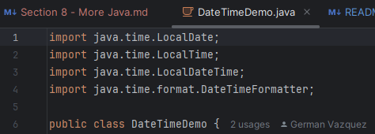
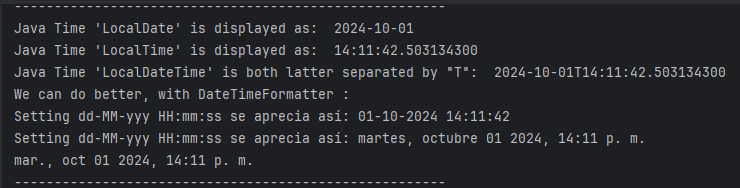

# Sección 8

## 50 - Java Date & Time

Java doesn´t have a built-in 'Date Class', so we need to import a 'Time Package' to work with dates.

We need to type manually BEFORE our class declaration.

`DateTimeDemo.java`

- This require import some classes.
- All `imports` come top on script, before the Class.

We can explore many Date & Time formats in Java

https://docs.oracle.com/javase/8/docs/api/java/time/format/DateTimeFormatter.html

Our outcome is:

## 51 - Java 'ArrayList' or 'Dynamic Arrays'

`ArrayListDemo.java`

We need to declare the size of an array before we can use it, once the size of the array is declared
it's hard to change it to handle this issue.

We can use the `ArrayList` Class.

It allows us to create a resizable arrays.

Unlike arrays, `ArrayList` can automatically adjust its capacity.

When we add or remove elements from it, hence `ArrayList` are also known as `Dynamic Arrays`.

## 52 Java HashMap

`MapsDemo.java`

This is an Array for `Key-Value` data pairs.

`HashMap<K,V> numbers = new HashMap<>();`

The hash map class implements the map interface; it stores elements and key value pairs where `keys` are
unique and identifiers used to associate each `value` on the map.

NOTE: HashMap parameters do NOT allow `int` primitive data types.

We must change to `Integer` to do so.

https://docs.oracle.com/javase/8/docs/api/java/util/HashMap.html

## 53 Java 'Iterator'

`ArrayListDemo.java`

//The first time we use Iteratos, we get first array value
//Second time, second value, and so on.

Iterators can also be used to loop through a collection,

`MapsDemo.java`

## 54 - 'ArrayList' of 'Maps'

`ListOfMaps.java`

## Java File Object

Java has several methods for creating, reading, updating and deleting files.

The file class from the Java IO package allows us to work with files.

The file class has many useful methods for creating and getting information about files.

For example:

- canRead()

Test whether the file is readable or not

- canWrite()

Test whether the file is writable or not.

- createNewFile

Create some empty file.

- delete()

Delete the file

- exists()

Tests whether the file exists,

- getName()

Returns the name of the file.

- getAbsolutePath()

Returns the absolute path name of the file

- length()

Return the size of the file in bytes

- list()

Returns an array of the files in the directory.

- mkdir()

Creates a directory.