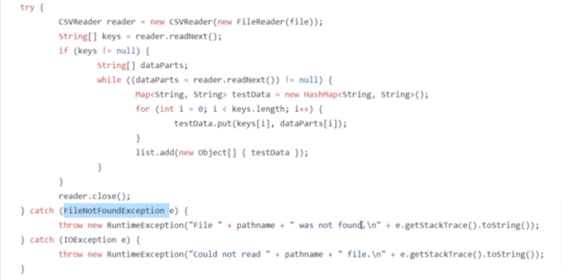

# Notas del curso [Java for Testers](https://softtek.udemy.com/course/java-for-testers-dmitry/) by Dmitry Shyshkin.


## Seccion 5 - Java Basics

### Java Operators

`Operators`

Operators are used to perform operations on Variables and Values.

1. Arithmetical Operators

    - Used to perform common mathematical operations.
        - Addition, Subtraction, Multiplication, Division.
        - Increment Operators, ++a,
        - Decrement Operators, --b

2. Assignment Operators

    - Assign values to Variables. Variable ' = ' Value.
        - c += 3    ==    c+3

3. Comparison Operators

    - To compare two values.
        - Equal, =
        - Not Equal,  !=
        - Greater Than,  >
        - Less Than, <

4. Logical Operators

    - Logic between variables and values.
        - AND - &&
        - NOT - !=
        - OR - ||

````java
public class Operators {
    public static void main(String[] args) {

        //Arithmetical Operators
        int a = 100;
        int b = 50;

        System.out.println(a + b); //Addition
        System.out.println(a - b); //Substraction
        System.out.println(a * b); //Multiplication
        System.out.println(a / b); //Division

        System.out.println("Add 1 to a = 100, three times in a row");

        System.out.println(++a); //Incremental 1
        System.out.println(++a); //Incremental 1
        System.out.println(++a); //Incremental  - 103

        System.out.println("Substract 1 to b = 50, three times in a row");

        System.out.println(--b); //Decremental 1
        System.out.println(--b); //Decremental 1
        System.out.println(--b); //Decremental - 47


        //Assignment Operators
        int c = 10;

        //c = c+3;
        c += 3;  // Nueva sintaxis de adición.
        System.out.println(c); // Print c = 10 + 3


        int sum = a + b + c; // Creamos una nueva variable con base en 2 anteriores (mismo tipo).
        System.out.println(sum); //103 + 47

        System.out.println("------------------");
        System.out.println("Add a + b + c is equal to: " + sum);

        System.out.println("------------------");
        System.out.println("Comparison Operators");

        //Comparison Operators, Boolean response
        System.out.println(a == b); // Is 'a' equal to 'b' ?
        System.out.println(a != b); // Is 'a' not equal to 'b' ?
        System.out.println(a > b); // Is 'a' greater than 'b' ?
        System.out.println(a < b); // Is 'a' less 'b' ?
        System.out.println(a >= b); // Is 'a' greater or equal 'b' ?
        System.out.println(a <= b); // Is 'a' less or equal 'b' ?

        //Logical Operators, Boolean response

        System.out.println("------------------");
        System.out.println("Logical Operators");

        //System.out.println(3 > 2);
        System.out.println(3 > 2 && 10<15); // AND Logical operator - True AND True = True
        System.out.println(3 > 2 && 10<9); // AND Logical operator - True AND False = False
        System.out.println(3 > 2 || 10<9); // AND Logical operator - True OR False = False


    }
}

````


### 19 - Java If ... Else

`IfElseDemo`

- Depending on the condition, it enters the statements.
- Also, can have NESTED IF's inside ELSE's.

````java
public class IfElseDemo {
    public static void main(String[] args) {
        int x = 11;

        if (x == 10) {
            System.out.println("x is 10");
        } else if (x > 10) {
            System.out.println(x + " is more than 10");
        } else {
            System.out.println(x + " is less than 10");
        }

        boolean cold = true;
        int time = 1900;
        if (time < 1200) {
            System.out.println("Good morning");
        } else if (time >= 1200 && time < 1800) {
            System.out.println("Good afternoon");
        } else {
            if (cold) {
                System.out.println("Good evening, it's cold");
            } else {
                System.out.println("Good warm evening");
            }
        }
    }
}
````


### 20 - Java Switch Statement

`SwitchDemo`

Look for a SPECIFIC condition, and DO that.

[Real Life Example](https://github.com/dimashyshkin/advanced-selenium-webdriver/blob/master/PART%206/Lecture%2049/advanced-selenium-webdriver/src/main/java/com/herokuapp/theinternet/base/BrowserDriverFactory.java)


````java
public class SwitchDemo {
    public static void main(String[] args) {
        int mes = 14;
        switch (mes){

            case 1:
                System.out.println("Enero");
                break;
            case 12:
                System.out.println("Diciembre");
                break;

            default:
                System.out.println("Número de mes incorrecto: " + mes);
        }
    }
}
````


### 21 - HomeWork1Sol.java

`Homework1` - Code

`Homework1Sol` - Solution

        // Using IF ELSE statement, write a program that will
        //Print "Negative" if the number is negative
        //Print "Zero" if number is zero
        //Print "Small" if number is 10 or less
        //Print "Less than 100" if number is less than 100
        //Print "Too big" if number is 100 or more
        //Print "Jordan" if number is 100 or more

### 22 - Homework2
Using Switch statement, print day of the week, depending on a dat number from 1 to 7.

`Homework2` 


## LOOPS

### 23 - 'For' Loop

Sometimes we need to execute the same block of court a few times for that we can use loops.

Similar to 'if' statement we write 'for', then brackets for condition, then curly brackets that will hold
the body of the loop.

`ForLoop`

````java
byte pages = 12;
for (byte j = 0; j <= pages; j++) {
        System.out.println(j); // Now we run through all 0 to 'pages'.
}
````

But unlike if statement, the condition is not something simple that returns Boolean.

### 24 - 'While' Loop
The difference between 'for' a loop and 'while' loop is that in the 'for' loop, the number of iterations to be done **is already known** and is used to obtain a certain result.

Whereas in the 'while' loop, the command runs until a certain condition is reached. Only then the process stop.

If there's no STOP condition, loop will run indefinitely.

#### 'While'


Check for the condition, then executes the code.

````java
byte i = 0;
while (i < 5){
        System.out.println(i);
i++;                      // Break condition, to avoid infinite Loop.
        }
````


#### Do While

`WhileLoop` 

Executes the code, then checks for the condition status if you need to continue the loop.
````java
do {
        System.out.println(i);
i--;
        } while (i > 0);
````


### 25 - Break & Continue inside LOOPS

`BreakAndContinue`

**Break** interrupt the execution of the loop.
- Nested as IF inside a FOR loop.
- It's used to finish the loop earlier.
- We already used it in 'SWITCH' loop.
- Usefull when looking for something in a pages list, when found, finish the search.


````java
byte pages = 12;
for (byte j = 0; j <= pages; j++) {
        System.out.println(j); // Now we run through all 0 to 'pages'.

  if (j == 5) {   // Enter here only on condition J == 5
        System.out.println("STOP");  // Do something
      break;      // Finishes loop run.
              }
              }
````


**Continue** skips or jumps, am iteration in the loop, then continues with the next.
- It SKIP a specific iteration, and move on with next one.
- Nested as IF inside a DO-WHILE loop.
````java
byte pages = 12;

do {
        if (pages == 8){
        System.out.println("No imprimas este número");
pages--;    // Make sure to add the counter, to avoid infinite loop.
        // Otherwise variable 'pages' don't update and will skip the counter
        // and return here forever.
        continue;
        }
        System.out.println(pages);
pages--;
        } while (pages > 3);
````


### 26 - Try Catch

`TryCatch`

Execute the code, and after failing, fail better next time.

````java
public class TryCatch {
    public static void main(String[] args) {

        String[] students = {"Dmitry","Olga","Ramon"};
        try {
            System.out.println(students[3]); // Select Line > Menu Code > Surround With >  try / catch
        } // catch (Exception e) {
            catch (ArrayIndexOutOfBoundsException e) { // Copy and Paste EXACT exception from terminal.
          //  throw new RuntimeException(e);        // This was automatic
                System.out.println("Exception happened: " + e.getMessage());
        }

        System.out.println("Moving on the next task...");
        
    }
}
````

Used to prevent and handle 'Exceptions', better known as ERRORS.
- Normally an exceptions interrupts our code, by failure and stops everything.
- With Try-Catch, we can 'handle it', recognize it, and move on with the rest of the code.

It's useful to avoid breaking WorkFlows.

Also, can handle more than a single exception, like this example:

*[Real life example](https://github.com/dimashyshkin/advanced-selenium-webdriver/blob/master/PART%206/Lecture%2049/advanced-selenium-webdriver/src/main/java/com/herokuapp/theinternet/base/CsvDataProviders.java)*




### 27 - Homework3

`Homework3` 

````java
public class Homework3 {
    public static void main(String[] args) {
        // Write a loop, to print numbers in descending order
        // starting from 50 and with a step of 5, not 1.
        // End the loop at 0.

        byte cuenta = 50;

        do {
            System.out.println(cuenta);
            cuenta -= 5;
        } while (cuenta >= 0);

        System.out.println("---------------");

        for (int i = 50; i >= 0 ; i -= 5) {
            System.out.println(i);
        }


    }
}
````


28 - Homework4

`Homework4` Replace letter 'o' for a ZERO '0' in the String 'Hello World!'.

````java
public class Homework4 {
    public static void main(String[] args) {

        //Write a loop, that will replace all characters 'o' with '0'

        String str = "Hello world!";
        String newStr = "";      // Arreglo vacío, sin tamaño definido.

        byte i = 0;
        while (i < str.length()) {
            char x = str.charAt(i);
                if (x == 'o') {
                    newStr = newStr + 0;
                } else {
                    newStr = newStr + x;
                }
            i++;
        }

        System.out.println(newStr);

    }
}
````

