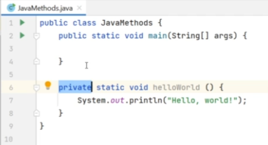
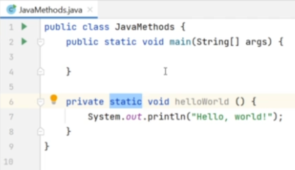
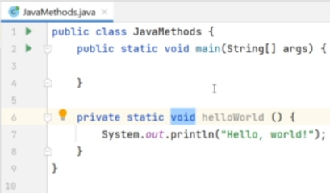
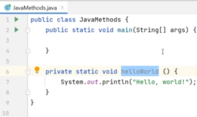
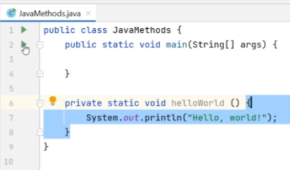
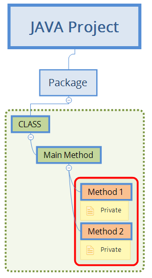
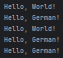
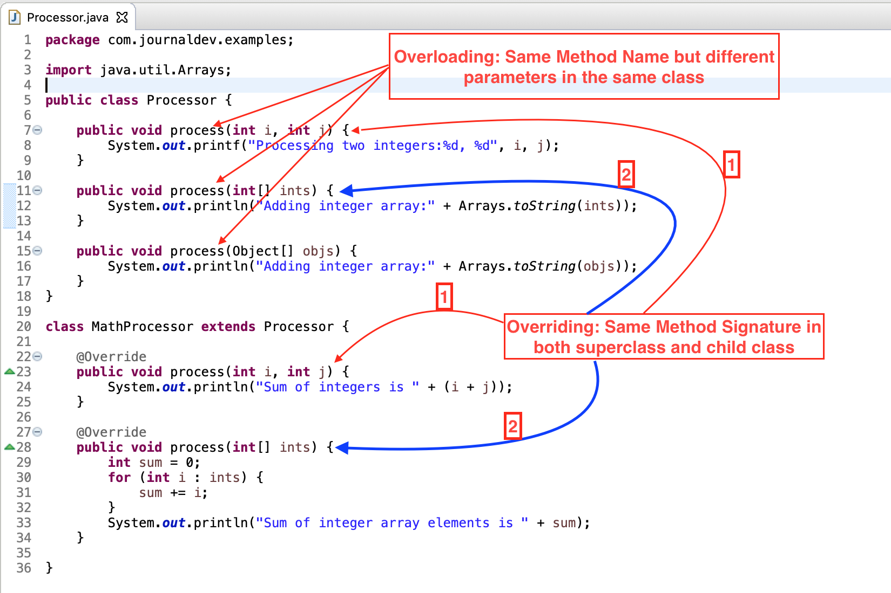

## Section 6 - Java Methods

### 29 - Java Methods (Sub-Routines or Code Snippets)

- A `Java Method` is the collection of statements that group together to perform an operation.
- It's a block of code that ONLY runs when it's called or _**instantiated**_. 
- We can pass 'DATA' or feed `Variables`, better known as `PARAMETERS`, to a method to run code.


- We use methods to reuse code: 
  - define code ONCE and 
  - use it MANY times.


- Methods Go Inside a Class, but
- Go Outside the 'main' method, usually at bottom of our *.java file.

>Java Class
>> `main` method
>
>> Custom method

Like this:

````java
public class JavaMethodsFull {

    public static void main(String[] args) {
        helloWorld();
    }

    private static void helloWorld(){
        System.out.println("Hello, world!");
    }
}
````

- `Methods` can be summoned from another Classes with `extends` method. (**_Inheritance_**)
- Able to contain a whole code.
- Are summoned from Inside the Class.
- Do Have 'Access Modifiers' and 'Parameters'


> Package - MyFirstJavaProject - Start UPPPERCASE
>> Class - HelloWorld - Start UPPPERCASE
> 
>>> main - method - Start lowercase
>
>>> Custom - method - Start lowercase - Access Modifier
>>>> Arguments - Array of strings
>>>>> Actual Java code - Print to console "Hello World!"
>>>>>> Variables - Start lowercase


A Java method is the collection of statements that are grouped together to perform an operation.
In other words, a method is the block of code, which only runs when it's called.

You can pass data known as 'parameters' into a method.
We use methods to reuse code defined only once that's used many times.

`JavaMethods1`

````java
public class JavaMethods1 {

  public static void main(String[] args) {
    helloWorld();
    name();
    helloWorld();
    name();
    name();
  }

  private static void helloWorld(){
    System.out.println("Hello, World!");
  }
  private static void name(){
    System.out.println("Hello, German!");
  }

}
````

Access Modifiers of Methods:

- **private** is access modifier
    - Since this method will be private we will be able to use it only inside of this class, but we will not be able to 
  call this method from other classes.
    - 
  
- **static**
    - Static methods are the methods in Java that can be called `without` creating an object of a class.
    - Statis methods ara called easily, in other words.
    - 
- **void**
    - 'void' means that this method does not have a return value.
    - It does not give an outcome, nor delivers a response.
    - 
- **name of the method**
    - Every 'method' needs a name followed by round brackets '()' to hold the parameters, if any.
    - If not, the round brackets remain empty.
    - 
- **method body**
  - Actual code, in this case a PRINT to console.
  - 

> Note that there is no RUN bottom next to this method, like we have next to our 'main' method.

We cannot just run it directly. We need to RUN the method that is calling it (instantiating).
When we run this class `main` method will be executed.

Now, let's call this method **_from_** the `main` method. So all we have to do it just type the name of our method, which is 
`helloWorld` and as you see intelligent out to suggest our methods.

So `helloWorld` with open close brackets and semicolon '**;**' at the end.

That's how we call our method.



Now, we can run it as much as many times it's called, or instantiated.



These lines were printed, since these methods were executed from the methods called.

---

### 30 - Java PARAMETERS (Arguments, or Variables of that Method)

`JavaMethodsFull`

- Parameters act as variables inside the 'methods'
- Parameters are specified after the method name inside the parentheses.
    - You can create the method that accepts as many parameters as you want.
        - Those parameters can be a different type, just separate them by ',' commas.

````java
public class JavaMethodsFull {

    public static void main(String[] args) {
        age("German", (byte) 38);
    }

    private static void age(String name, byte years){
        System.out.println(name + " is " + years + " years old.");
    }
}
````
---   

### 31 - Method overloading

`JavaMethodsFull`

- Method overload in multiple methods can have the `same name` but `different parameters`.
- You can have two methods with same name and data type, as long as the number of parameters are NOT the same.
- 

````java
// Method overloading
private static void suma(byte a, byte b){
  byte sum = (byte) (a + b);
  System.out.println(sum);
}

private static void suma(int a, int b){
  int sum = a + b;
  System.out.println(sum);
}

private static void suma(int a, int b, int c){
  int sum = a + b + c;
  System.out.println(sum);
}

private static void suma(double a, double b){
  double sum =  a + b;
  System.out.println(sum);
}
````

---
- IntelliJ suggests which one to use.
- HERE it's super usefully the JAVA DOCS comments.
---


> There's another level of complexity: `OVERRIDE`

If a method is present in both SuperClass and ChildClass, and happens to share both Name & Arguments, but different 
code inside then:

> Which method will be executed?

For that, we use the TAG `@Overrride` just ahead of our 'twin' method.

> We'll see this annotation further in this course, in the `Inheritance` lecture in Section 7, when `Cat.java` extends `Animal.java`.



For more info about this, refer to:

https://www.digitalocean.com/community/tutorials/overriding-vs-overloading-in-java#comparing-overriding-and-overloading 


### 32 - Method RETURN type

`JavaMethodsFull`

Currently, all our methods have a 'void' keyword in the method signature, which means they do not return anything.

Let's create the method that returns a value, and ask for it.

````java
public class JavaMethodsFull {

    public static void main(String[] args) {
        System.out.println(square(4));
    }

    private static int square(int i){
        //  int cuadrado = i * i;
        //  return cuadrado;
        return i * i; // Mejora de IntelliJ
    }

}
````

- Now, after STATIC instead of `VOID` and before the method NAME, we define there's an outcome of data type `INT`.